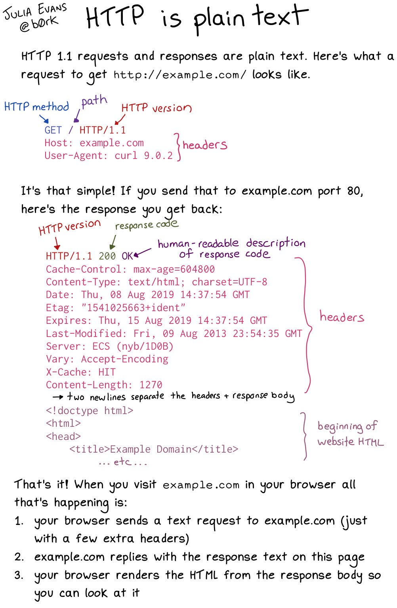

# Introduction

A *RESTful architecture*, is an architectural style ([Fielding](https://www.ics.uci.edu/~fielding/pubs/dissertation/top.htm)) for providing resources to clients using a set of request verbs and resource locations. A REST API allows a client to access resources provided by a service.
You can read more about REST apis [here](https://github.com/CSC-326/Course/raw/master/Slides/RESTAPI_Frameworks.pptx).


In this workshop, you will learn the concepts associated with REST APIs, practice accessing an existing REST api as a client, and implement a REST service.

## Concepts

Simply put, an API (or Application Programming Interface) defines a specification for how to communicate with a computer program or subset thereof. An API lays out what functionality is offered, what parameters must be provided when making calls, and provides some guarantees about the return type given the preconditions are satisfied. Fundamentally, a complete and well-documented API makes it easier to use a piece of code as a “building block” for building a larger system.

A REST API is a subtype of API that is geared towards Internet-facing systems. The goal of REST APIs is to provide painless communication and interoperability between these Internet-facing applications and systems. REST APIs typically allow (often with some sort of authentication) a manipulation of the various types of entities (recipes, inventory, etc) that a web application revolves around.

The key concept behind REST APIs is that they are inherently stateless, that is, everything that a server needs to know to complete a request or a client needs to know about the results is contained within the request itself. This is contrary to the notion of a server maintaining a session where it stores information about a series of transactions with a particular client, or cookies where a client keeps similar information stored on its end.

REST APIs typically consume and produce JSON-formatted content. A successor to XML, JSON documents are easy for a computer to parse and easy for a human to read.

### Verbs

Typically, REST API operations are carried out over HTTP; consequently most REST API actions are based around HTTP verbs (POST, PUT, DELETE, and so on). The actions typically available are:

| HTTP Verb	| Action             |	Example	       |Result  | 
| --------- | ------------------ | --------------- |------- |
| GET	    | Retrieve record(s) | GET /users/	   | Retrieves all users|
| DELETE	| Delete record(s)	 | DELETE /users/1 | Deletes user with id 1|
| POST	    | Create record	     | POST /users/	   | Creates a new user|
| PUT	    | Update record	     | PUT /users/6	   | Updates user 6|

### HTTP




## Practicting with a REST Client

Let's see how a javascript client application can communicate with a server using a REST API call.

### Sending a GET request from inside the browser

In a browser, visit http://httpbin.org/

Open the developer's tool console (in your Web browser) and execute this code inside of the console.

*Note:* If you try this same code from a different page, you'll get a Cross-Origin Resource Sharing (CORS) error.

```Javascript
fetch("https://httpbin.org/anything")
    .then(data => data.json())
    .then(result => console.log(result));
```

This constructs as simple `GET` request to `/https://httpbin.org/anything` and returns a copy of what was sent.

### Sending a PUT request from inside the browser

```javascript
// The data we are going to send in our request
data = {
    coffee: 1, milk: 1, sugar: 1, chocolate: 1
}
// Headers describing how the request body is formatted.
headers = new Headers();
headers.append('Content-Type', 'application/json');
// Request information
fetchData = { 
    method: 'PUT', 
    body: JSON.stringify(data),
    headers: headers
}
fetch('https://httpbin.org/anything', fetchData)
    .then(data => data.json())
    .then(result => console.log(result));
```

### Sending request using curl

Here are the same examples as above, but written to work with curl:

```bash
curl --request GET https://httpbin.org/anything
```

```bash
curl --request PUT -H "Content-Type: application/json" --data '{"coffee":1,"milk":1,"sugar":1,"chocolate":1}' https://httpbin.org/anything
```

### API tools

Although debugging from the browser console window or with command line tools can be useful, investing in web traffic/API tools could be worthwhile. Here are two popular tools, which are frequently used in industry:

* [Postman](https://www.getpostman.com/postman)
* [Fiddler](https://www.telerik.com/fiddler)

## Programmatic API requests

You will get practice interacting with the GitHub REST API.

Before you start, make sure you have a local copy of this workshop, and change your working directory (`cd REST`).

```bash
git clone https://github.com/CSC-510/REST
```

### 1. Get a token. 

Go to your profile page on github.


<hr/>

Save your token in an [environment variable](https://github.com/chrisparnin/EngineeringBasics/blob/master/Shells.md#environment-variables).

```bash
# Mac/Linux
export GITHUBTOKEN="xxx"
# Windows
setx GITHUBTOKEN xxx
```

### 2. Test sample code

Install node package dependencies into `node_modules/`

```bash
npm install
```

Edit index.js to replace `var userId = "chrisparnin"` with _your_ github username.

Now run the script. You should be able to see a list of your repos (may be empty, we'll fix that!).

```
node index.js
```

Here is the key part of the code that makes the actual REST request:

```javascript
    // Setting url, HTTP METHOD, and necessary headers.
	var options = {
		url: urlRoot + '/users/' + userName + "/repos",
		method: 'GET',
		headers: {
			"User-Agent": "CSC510-REST-WORKSHOP",
			"content-type": "application/json",
			"Authorization": `token: ${config.token}`
		}
	};

	// Send a http request to url and specify a callback that will be called upon its return.
	return request(options, function (error, response, body) 
	{
        // callback function that runs when response from server is received!
        ...
    });
```

##### Debugging

You can debug REST api calls using `curl`. 

A simple example for getting all repos of authenicated user.

```
curl --request GET -H "Authorization: token $GITHUBTOKEN" https://api.github.com/user/repos

```

A more complex example: Change a repositories settings to have issue support.

```
curl --request PATCH -H "Authorization: token $GITHUBTOKEN" --data '{"name":"hw4","has_issues":"true"}' https://api.github.com/repos/chrisparnin/ganji
```

Tips for extending.

* `-H` allows you to set headers as part of your request.
* Just replace the `--request` with your METHOD (e.g., GET, POST). 
* You need `--data` when using POST/PATCH, that will be the data sent to the server.


### 3. With a partner

Do the following tasks with a partner. For each task, consider what's the right HTTP VERB, the REST API url, and what part of the response body should you print out?

* Write code for listBranches in a given repo under an owner. See [list branches](https://developer.github.com/v3/repos/#list-branches)
* Write code for [create a new repo](https://developer.github.com/v3/repos/#create)

### 4. On your own

Do the following tasks, on your own:

* Write code for [creating an issue](https://developer.github.com/v3/issues/#create-an-issue) for an existing repo.
* Write code for [editing a repo](https://developer.github.com/v3/repos/#edit) to enable wiki support.


## A Simple REST Server

Let's practice creating a simple REST server!

We will be working in the `server/` directory.

```bash
cd server/
```

Install packages (express)

```
npm install
```

Start the server

```bash
node index.js
```

Send a simple GET request, and get a response!

```bash
$ curl --request GET http://localhost:3000/
Hello World!
```

Send a simple POST request with data:

```bash
$ curl --request POST -H "Content-Type: application/json" --data '{"coffee":1,"milk":1,"sugar":1,"chocolate":1}' http://localhost:3000/
Received object. {"coffee":1,"milk":1,"sugar":1,"chocolate":1}
```

### Create a simple one-time sharing service

* POST an json object to `/share/`. Return an url with unique retrieval id
* GET the given `/<id>`. Retrieve the object. Further updates should return an error.

You should be able to test your code using the following sequences of commands.

```bash
# Post content to server. Service returns retrieval link.
$ curl --request POST -H "Content-Type: application/json" --data '{"coffee":1,"milk":1,"sugar":1,"chocolate":1}' http://localhost:3000/share
{"success":true,"link":"http://localhost:3000/pgiPc2"}
# Retrieve content
$ curl http://localhost:3000/pgiPc2
{"coffee":1,"milk":1,"sugar":1,"chocolate":1}
# A second read will result in "Not Found" message.
$ curl http://localhost:3000/pgiPc2
{"success":false,"error":404,"message":"Not Found"}
```